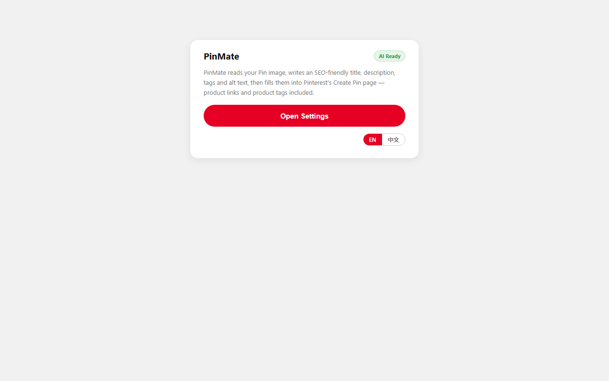
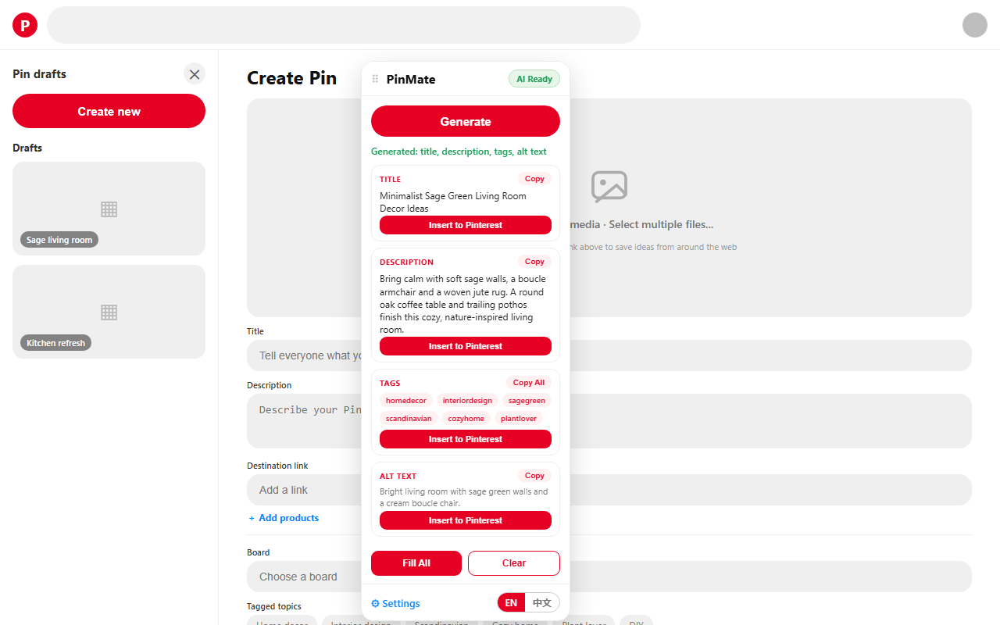
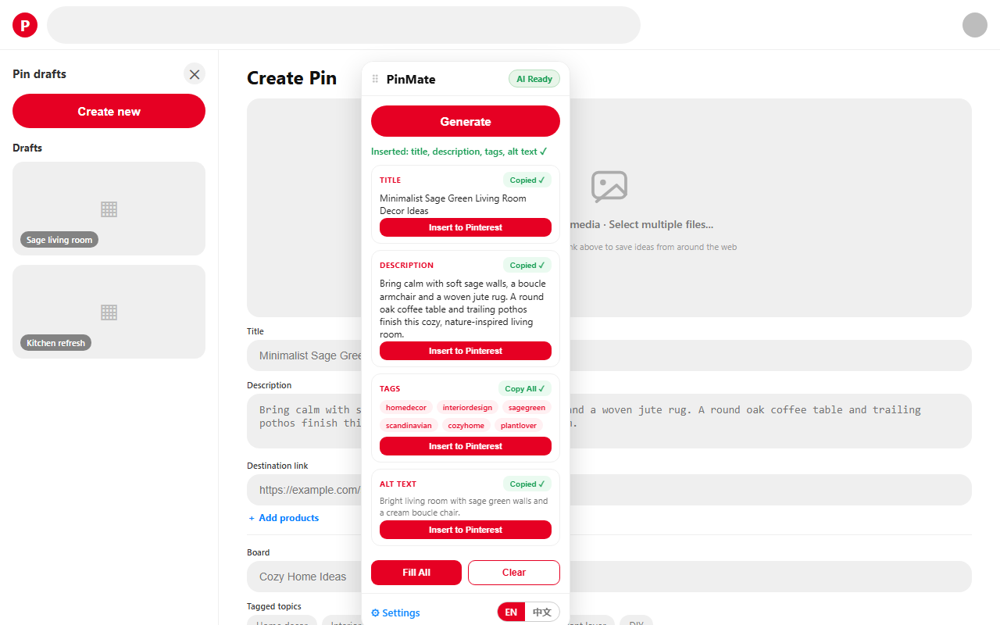

<div align="center">
  
</div>

<h1 align="center">PinMate</h1>

<p align="center">
  <a href="https://chromewebstore.google.com/detail/gcehclfjagcpddjcbjnpbifibnlpkkjg"></a>
  <a href="https://chromewebstore.google.com/detail/gcehclfjagcpddjcbjnpbifibnlpkkjg"></a>
  <a href="./LICENSE"></a>
</p>

<p align="center">
  <a href="https://chromewebstore.google.com/detail/gcehclfjagcpddjcbjnpbifibnlpkkjg"><strong>➜ 从 Chrome Web Store 安装</strong></a>
</p>

> **PinMate** 是一款 Chrome 扩展，利用 AI 视觉模型自动分析 Pinterest Pin 图片，一键生成 SEO 优化的标题、描述、话题标签与替代文本，并直接填入 Pinterest 发布表单。

---

## ✨ 功能

- **🧠 智能图片分析** — 调用多模态 AI（视觉模型）理解 Pin 图片内容，识别主题、场景、风格、受众等
- **✍️ SEO 内容生成** — 基于分析结果生成 Pinterest 友好的标题、描述和标签，提升搜索曝光
- **⚡ 一键填入** — 将生成的内容直接填入 Pinterest 创建 Pin 的表单，无需复制粘贴
- **🔄 双模式工作流** — 支持「分析 → 生成」分步执行或「一键生成」合并执行
- **🌐 双语支持** — 中英文界面运行时切换，生成内容语言自动匹配
- **🔧 多 AI 提供商** — 支持 SiliconFlow、OpenAI、Gemini 及任意 OpenAI 兼容端点
- **🎯 模型下拉预选** — 每个提供商内置经核实的多模态模型清单，可直接下拉选择，也可自定义模型 ID
- **🔒 隐私优先** — API Key 仅存储在本地 `chrome.storage.local`，无内置密钥
- **🖱️ 可拖拽浮层面板** — 在 Pinterest 页面上浮动显示，可自由拖拽位置

---

## 📸 截图

| 设置页 | 一键生成 | 填入 Pinterest |
|:---:|:---:|:---:|
|  |  |  |

<details>
<summary>English screenshots</summary>

| Settings | One-click generate | Filled into Pinterest |
|:---:|:---:|:---:|
|  |  |  |

</details>

---

## 🚀 安装

### Chrome Web Store（推荐）

前往 [Chrome Web Store 页面](https://chromewebstore.google.com/detail/gcehclfjagcpddjcbjnpbifibnlpkkjg) 点击「添加至 Chrome」，安装后右键扩展图标 → **选项** 进入设置页配置 API Key。

### 开发者模式手动安装

1. 下载或克隆本仓库：
   ```bash
   git clone https://github.com/vaxicy/PinMate.git
   ```
2. 打开 Chrome → `chrome://extensions/`
3. 开启右上角 **开发者模式**
4. 点击 **加载已解压的扩展程序**，选择项目目录
5. 在扩展管理页点击 PinMate 的 **详情** → **扩展程序选项** 进入设置
6. 选择 AI 提供商、填入 API Key、选择模型，点击 **Save** 后可用

> ⚠️ 修改源码后需在 `chrome://extensions` 点击 PinMate 的 **Reload** 才会生效；已打开的 Pinterest 标签页需刷新一次重新注入面板。

---

## 📖 使用指南

### 三步工作流

1. **设置 API**
   - 右键 PinMate 图标 → **选项** 进入设置
   - 选择 AI 提供商（SiliconFlow / OpenAI / Gemini / 自定义）
   - 填入你的 API Key，选择模型，点击 **Save**
   - 可点击 **Test Connection** 验证 Key 与端点是否可用

2. **打开 Pinterest 创建 Pin 页面**
   - 进入 Pinterest 创建页（`pin-creation-tool`、`pin-builder`、`create-pin` 三种路由均支持）
   - PinMate 浮层面板自动出现

3. **生成内容并填入**
   - **分析图片** — 点击分析按钮，AI 解读图片内容
   - **生成内容** — 基于分析结果生成标题、描述和标签
   - **一键生成** — 合并以上两步，直接产出完整内容
   - **填入** — 点击填入按钮，内容自动写入 Pinterest 表单

> 💡 **提示**：填入后请手动检查标题/描述区域，Pinterest 可能偶尔切换焦点导致填入不完整；如遇到可再次点击填入。

---

## ⚙️ 配置

### AI 提供商

| 提供商 | 兜底默认模型 | 备注 |
|--------|------------|------|
| SiliconFlow | `Qwen/Qwen3-Omni-30B-A3B-Instruct` | 推荐中国用户，国内可直连 |
| OpenAI | `gpt-4o` | 需国际网络 |
| Gemini | `gemini-2.5-flash` | Google 官方多模态模型 |
| 自定义 | 用户指定 | 任意 OpenAI 兼容端点 |

每个提供商的设置**独立保存**，切换时互不覆盖。模型字段为**下拉预选 + 自定义输入**双形态：下拉内仅收录该提供商经核实支持图像输入的多模态模型，末项选「Custom」可自由填写任意模型 ID。

> **测试连接说明**：点击「Test Connection」时扩展调用的是提供商的 `GET /v1/models` 列表接口做轻量连通性校验，不消耗 tokens、不触发模型推理。若连接的 Key 与地址正常但你选的模型不在返回列表中，会显示橙色提示，此时请核对模型 ID 拼写。

### 设置选项

- **语言**：中文 / English（运行时切换，无需重载）
- **AI 提供商**：选择上述四种之一
- **API Base URL**：一般保持默认即可；接入自建/第三方兼容端点时填写
- **API Key**：你的个人密钥（仅存本地，输入框内可一键显示/隐藏）
- **模型**：下拉选择预选模型，或选 Custom 手动输入
- **生成语言**：生成内容的语言（English / 中文）
- **面板显示范围**：所有 Pinterest 页面，或仅在创建 Pin 页面显示

---

## 🔐 商店主机权限理由（Chrome Web Store 表单填写）

本扩展的 `host_permissions` 包含一条宽泛权限 `https://*/*`，用于在「自定义」提供商模式下请求用户自己填写的任意 OpenAI 兼容端点。提交商店审核时请按以下文案填写「主机权限理由」：

```
https://*/*：扩展支持用户自定义任意 OpenAI 兼容端点（Custom OpenAI-compatible endpoint）。当用户在设置中选择自定义并填入自有 Base URL 时，扩展需通过用户自己的 API 密钥向该端点发送请求，因此需申请对所有 HTTPS 网站的访问权限。该权限仅在用户主动配置并使用自定义端点时生效，扩展不会后台静默访问或读取任何无关网站内容。
```

（具体域名 `https://*.pinterest.com/*` 用于向 Pinterest 创建页注入浮层面板，属内容脚本注入所需，与生成请求无关。）

---

## 🛠️ 技术架构

```
PinMate/
├── manifest.json          # 扩展清单 (Manifest V3)
├── popup.html             # 弹出窗 UI
├── settings.html          # 设置页（选项页）
├── _locales/
│   ├── en/                # 英文翻译
│   └── zh_CN/             # 中文翻译
├── js/
│   ├── background.js      # Service Worker（AI 请求转发）
│   ├── content.js         # Pinterest 页面注入的浮层面板
│   ├── ai.js              # AI API 客户端
│   ├── i18n.js            # 运行时双语引擎
│   ├── storage.js         # chrome.storage 封装
│   ├── popup.js           # 弹出窗控制器
│   └── settings.js        # 设置页控制器
├── css/
│   ├── style.css          # 弹出窗 & 设置页样式
│   └── panel.css          # 浮层面板样式
├── docs/                  # 隐私政策页（GitHub Pages 源）
├── assets/
│   └── icons/             # 扩展图标 (16/48/128)
└── store-assets/          # 商店素材（截图 / 宣传图 / 描述文案）
```

### 核心流程

1. `content.js` 在 Pinterest 创建 Pin 页面注入可拖拽浮层面板
2. 用户通过面板触发的 AI 请求经 `background.js` Service Worker 转发，规避 CORS
3. AI 返回的内容由 `content.js` 直接填入 Pinterest DOM 表单
4. 所有配置（API Key、语言、模型等）存储在 `chrome.storage.local`

---

## 📦 打包构建

使用项目内打包脚本（版本号自动从 `manifest.json` 读取）：

```powershell
python tools\pack-pinmate.py
```

产物同时输出到两处：

- `D:\迅雷下载\vibe coding\PinMate-<version>.zip`（默认文件夹，用于上传商店）
- 项目内 `PinMate-<version>.zip`（版本留存）

包内包含：

- 核心代码（`manifest.json`、`js/`、`css/`、`_locales/`、`popup.html`、`settings.html`、`docs/`）
- 扩展图标（`assets/icons/`）
- 微信赞赏码（`assets/wechat-reward.png`）

自动排除 `.git`、`.codebuddy`、`store-assets`、`tools`、素材生成脚本、截图模板及历史 zip 包。

---

## 🤝 支持项目

如果你觉得这个工具有用，欢迎通过以下方式支持：

- 在 [Chrome Web Store](https://chromewebstore.google.com/detail/gcehclfjagcpddjcbjnpbifibnlpkkjg) 留下评分与评价
- [PayPal 捐赠](https://www.paypal.com/ncp/payment/WVD4GLTERHKNQ)
- 微信赞赏（见设置页）

---

## 📄 许可证

本作品采用 **Creative Commons Attribution-NonCommercial-ShareAlike 4.0 International License** ([CC BY-NC-SA 4.0](https://creativecommons.org/licenses/by-nc-sa/4.0/)).

### 你可以：

- **共享** — 在任何媒介以任何形式复制、发行本作品
- **演绎** — 修改、转换或基于本作品创作

### 须遵守：

- **署名** — 必须标注原作者，提供许可证链接，并说明是否修改
- **非商业性使用** — 不得将本作品用于商业目的
- **相同方式共享** — 如果修改本作品，必须以相同许可证发布

### 例外

如果你希望获得商业授权，请联系：huangzero2004@gmail.com

完整许可证文本见 [LICENSE](./LICENSE) 文件。

---

## 🔗 相关链接

- [Chrome Web Store 页面](https://chromewebstore.google.com/detail/gcehclfjagcpddjcbjnpbifibnlpkkjg)
- [GitHub 仓库](https://github.com/vaxicy/PinMate)
- [隐私政策](https://vaxicy.github.io/PinMate/privacy-policy.html)
- [提 Issue](https://github.com/vaxicy/PinMate/issues)
